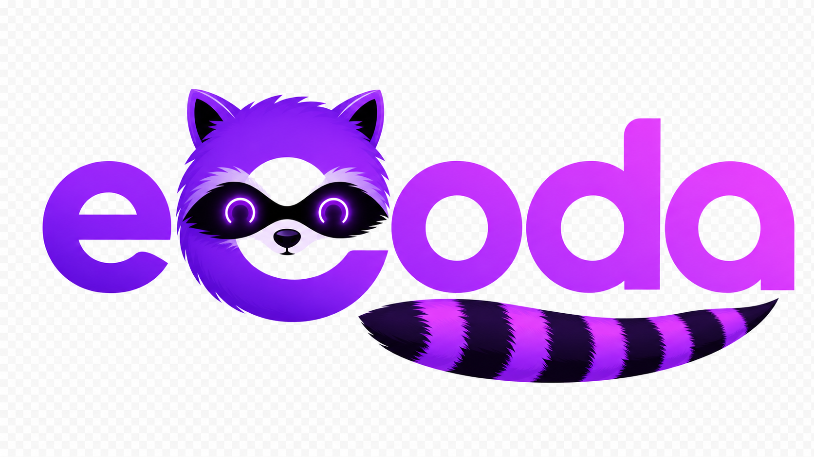
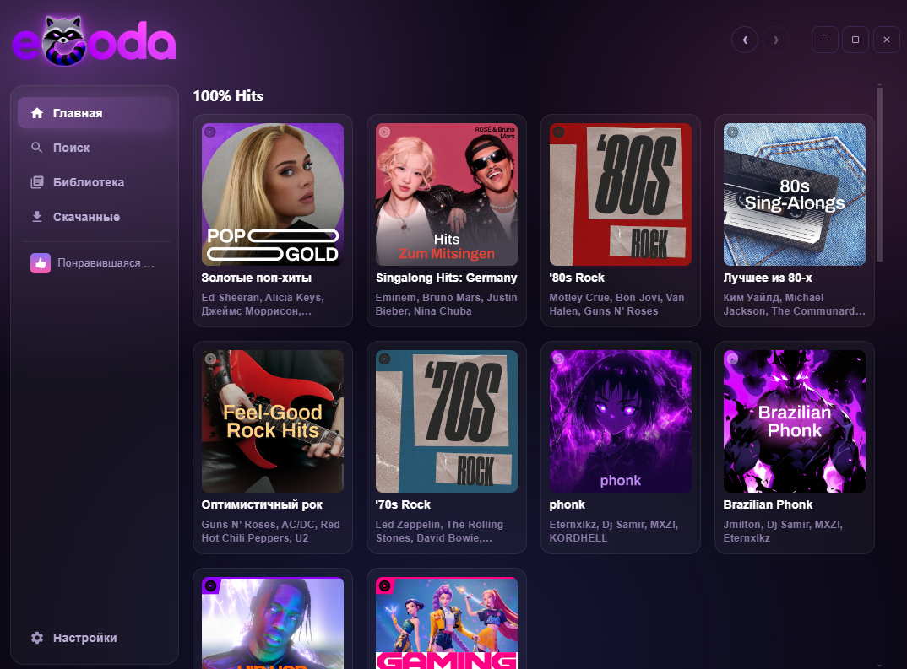

  

  ### Твой YouTube Music как обычное приложение для ПК

  
  

---

**eCoda** — это нативный десктоп-клиент для YouTube Music. Без браузерных вкладок, которые теряются среди тридцати других. Без открытой в фоне страницы YT, которая сжирает гигабайт RAM. Своё окно, свой плеер, своя библиотека.

Просто открываешь приложение — и слушаешь.

  

---

## ✨ Что умеет

- 🎵 **Твоя настоящая библиотека YT Music** — все плейлисты, «Понравившаяся музыка», подписки. То что у тебя есть в браузере — есть и тут
- 💾 **Качай музыку на диск** — отдельный трек, целый плейлист или всё что лайкнул. Слушай без интернета (например в самолёте)
- 🎚️ **Кросс-фейд между треками** — плавный переход вместо резкого обрыва. Настраивается ползунком 0–12 секунд
- 🪟 **Мини-плеер** — компактное окно поверх всех окон, чтобы переключать треки не отрываясь от работы. Два варианта: тонкая полоска или квадратик с обложкой
- ⌨️ **Медиа-клавиши работают** — Play/Pause/Next/Prev на клавиатуре, виджет на lockscreen Windows и в Now Playing на macOS
- 🎨 **8 цветовых тем** — от пастельных до неоновых
- 🦝 **Сворачивается в трей** — закрыл окно крестиком, музыка продолжает играть в фоне (можно отключить если бесит)
- 🌍 **Русский + English** интерфейс
- 🔁 **Помнит где остановился** — закрыл посреди трека, открыл назавтра, продолжил с той же секунды
- 🎲 **Для стримеров** — закрепляй интро трека на первом месте, тасуй остальное в один клик, drag-and-drop порядок треков

И ещё много мелочей которые видно только в процессе использования.

---

## 📥 Скачать

### [⬇️ Последняя версия на GitHub Releases](https://github.com/erneywhite/eCoda/releases/latest)

| Платформа | Файл | Размер |
| --- | --- | --- |
| **Windows 10/11** (x64) | `eCoda-Setup-1.0.0.exe` | ~131 MB |
| **macOS** (Apple Silicon — M1/M2/M3/M4) | `eCoda-1.0.0-arm64.dmg` | ~180 MB |

---

## ⚙️ Установка

### Windows

1. Скачай `.exe` по ссылке выше и запусти
2. Windows может ругнуться: «Защитник: приложение от неизвестного издателя» — это нормально для приложений без официальной подписи Microsoft ($300/год не платил, извините). Жми **«Подробнее» → «Выполнить в любом случае»**
3. Пройди инсталлятор как обычно
4. Запусти eCoda. Выбери из списка браузер, в котором ты уже залогинен на YouTube — eCoda прочитает оттуда твою сессию. Пароли вводить не нужно

### macOS

1. Скачай `.dmg`, открой, перетащи **eCoda** в **Applications**
2. Первый запуск: macOS заматерится — приложение не подписано через Apple Developer Program ($99/год тоже не платил). Это исправить просто:
   - **Правый клик на иконке eCoda** в Applications → **«Открыть»**
   - В появившемся окне ещё раз нажми **«Открыть»**
   - Это нужно сделать **один раз**, дальше будет запускаться обычным двойным кликом
3. Выбери браузер с залогиненным YouTube — eCoda прочитает оттуда cookies

---

## 🧩 Что нужно

- **Установленный браузер** где ты залогинен на YouTube. Поддерживаются почти все:
  Firefox, Chrome, Edge, Brave, Opera, Vivaldi, Chromium, Whale, Safari (только Mac) + форки Firefox (Waterfox, LibreWolf, Floorp, Zen)
  > Браузер не обязательно держать открытым — eCoda просто читает cookies оттуда при подключении
- **YouTube Premium** — крайне рекомендуется. С Premium треки идут в 256 kbps Opus и без рекламных пауз. Без Premium тоже работает, но с рекламой и качеством до 128 kbps
- Никаких регистраций, аккаунтов, телеметрии. Всё локально у тебя на диске

---

## 🎯 Как пользоваться (быстрый старт)

После того как подключил браузер:

- **Слева сайдбар** — Главная (рекомендации YT), Поиск, Библиотека (твои плейлисты), Скачанные (то что лежит на диске)
- **Понравившаяся музыка** автоматически появится в сайдбаре сверху как закреплённый плейлист
- **Любой плейлист можно закрепить** в сайдбаре кнопкой 📌 — будет всегда под рукой
- **Правый клик по треку** — меню: «Играть следующим», «В очередь», «Радио по треку», «Закрепить позицию»
- **Сердечко рядом с треком** — лайкнуть/убрать. Лайки синхронятся с YT
- **Кнопка ⛶ в шапке** (рядом со стрелками) — мини-плеер
- **⚙️ Настройки** внизу сайдбара — темы, язык, качество скачивания, кросс-фейд, поведение крестика, и т.д.

---

## ❓ Часто задаваемые

<b>Это легально?</b>

eCoda — это просто клиент к YouTube. Он использует тот же API что и официальный YT Music, и проигрывает только то что доступно в твоём аккаунте.

Тем не менее — это **неофициальный** клиент, не аффилирован с YouTube или Google. Используй на свой страх и риск, уважай правила YouTube.

<b>Будет ли мобильная версия?</b>

Нет, проект только для десктопа. На мобильных есть официальное приложение YT Music — оно отлично работает.

<b>Где хранятся скачанные треки?</b>

- **Windows:** `%APPDATA%\ecoda\offline\`
- **macOS:** `~/Library/Application Support/ecoda/offline/`

Можно открыть прямо из приложения: Настройки → Диагностика → «Открыть» рядом с «Папка кеша».

<b>Обновления приходят автоматически?</b>

Да, при запуске eCoda тихо проверяет наличие новой версии на GitHub Releases. Если есть — покажет в Настройках → Обновления. Можно скачать одним кликом и нажать «Перезапустить и установить».

Если апдейтер молчит — можно проверить вручную там же, кнопкой «Проверить обновления».

<b>На macOS Safari не работает / просит доступ</b>

Safari хранит cookies в защищённой папке, и eCoda нужен **Полный доступ к диску** чтобы её прочитать:

Системные настройки → Конфиденциальность и безопасность → Полный доступ к диску → включить eCoda

После этого перезапусти приложение и Safari появится в списке браузеров.

<b>Можно сменить аккаунт?</b>

Да — Настройки → Аккаунт → «Отключить». Потом снова выбрать браузер. Если хочешь сменить аккаунт YouTube — перелогинься в браузере, потом подключи его в eCoda заново.

<b>А что насчёт Linux?</b>

Linux-сборки пока нет. В принципе код кросс-платформенный (Electron + youtubei.js + yt-dlp работают везде), просто руки не дошли собрать `.deb`/`.AppImage` и протестить. Если интересно — открой Issue, или сделай PR.

---

## 🎨 Благодарности

- 🦝 **Маскот-енот + wordmark** — нарисовал **[╻٭𝕊˙𖣐˙ℝ˙𝔸˙𝕊٭╹](https://t.me/S_O_R_A_S)**.
- 🛠️ **[yt-dlp](https://github.com/yt-dlp/yt-dlp)** + **[youtubei.js](https://github.com/LuanRT/YouTube.js)** — без них этого приложения бы не было
- 🚀 **[Electron](https://www.electronjs.org/)** + **[Svelte](https://svelte.dev/)** + **[Deno](https://deno.com/)** — стек, на котором всё работает

---

## 📜 Лицензия + дисклеймер

[MIT](LICENSE) — делай с кодом что хочешь, только не вини меня если что-то сломается.

eCoda — **неофициальный** клиент, не связан с YouTube или Google. Сделан для личного использования. Уважай правила YouTube и местные законы.

Багрепорты и идеи — в [Issues](https://github.com/erneywhite/eCoda/issues).

Made with 🦝 by Erney White, 2026

---

<h3>🇬🇧 English version</h3>

### Your YouTube Music as a real desktop app

---

**eCoda** is a native desktop client for YouTube Music. No browser tabs that get lost among thirty others. No background YT page eating a gigabyte of RAM. Its own window, its own player, your library — proper.

Just open the app and listen.

  

---

## ✨ What it does

- 🎵 **Your real YT Music library** — all your playlists, Liked Music, subscriptions. What you have in the browser, you have here
- 💾 **Download music to disk** — per track, per playlist, or your entire Liked Music. Listen offline (planes, subway, dodgy hotel WiFi)
- 🎚️ **Track-to-track crossfade** — smooth overlap instead of hard cuts. Slider 0–12 seconds in Settings
- 🪟 **Mini-player** — always-on-top compact window to skip tracks without leaving what you're doing. Two layouts: horizontal pill or square cover-focused
- ⌨️ **Hardware media keys work** — Play/Pause/Next/Prev on your keyboard, Windows lockscreen widget, macOS Now Playing
- 🎨 **8 colour themes** — pastel to neon
- 🦝 **Closes to system tray** — hit the X, music keeps playing in the background (toggleable if you'd rather it actually quit)
- 🌍 **Russian + English** UI
- 🔁 **Remembers where you left off** — close mid-track, reopen tomorrow, picks up at the same second
- 🎲 **Streamer-friendly playlists** — pin an intro track at position 0, reshuffle the rest with one click, drag-and-drop reorder

Plus dozens of small touches you'll only notice while using it.

---

## 📥 Download

### [⬇️ Latest release on GitHub](https://github.com/erneywhite/eCoda/releases/latest)

| Platform | File | Size |
| --- | --- | --- |
| **Windows 10/11** (x64) | `eCoda-Setup-1.0.0.exe` | ~131 MB |
| **macOS** (Apple Silicon — M1/M2/M3/M4) | `eCoda-1.0.0-arm64.dmg` | ~180 MB |

---

## ⚙️ Install

### Windows

1. Download the `.exe` from the link above and run it
2. Windows might complain: "Defender: app from an unknown publisher" — normal for apps without an official Microsoft code-signing cert (it's $300/year, hard pass). Click **"More info" → "Run anyway"**
3. Step through the installer as usual
4. Launch eCoda. Pick a browser from the list where you're already signed into YouTube — eCoda reads your session from there. No passwords needed

### macOS

1. Download the `.dmg`, open it, drag **eCoda** into **Applications**
2. First launch: macOS will complain — the app isn't notarised through Apple Developer Program ($99/year, also hard pass). Fix is simple:
   - **Right-click eCoda** in Applications → **"Open"**
   - Click **"Open"** again in the dialog that appears
   - You only need to do this **once**; afterwards it launches with a normal double-click
3. Pick a browser signed into YouTube — eCoda reads cookies from there

---

## 🧩 What you need

- **An installed browser** signed into YouTube. Almost all are supported:
  Firefox, Chrome, Edge, Brave, Opera, Vivaldi, Chromium, Whale, Safari (macOS only) + Firefox forks (Waterfox, LibreWolf, Floorp, Zen)
  > The browser doesn't need to stay open — eCoda just reads cookies from it once during setup
- **YouTube Premium** — strongly recommended. With Premium, tracks come in 256 kbps Opus with no ad breaks. Works without, but with ads and quality capped at 128 kbps
- No accounts, no signups, no telemetry. Everything lives locally on your disk

---

## 🎯 How to use it (quick start)

After connecting a browser:

- **Sidebar on the left** — Home (YT recommendations), Search, Library (your playlists), Downloaded (what's saved to disk)
- **Liked Music** automatically appears in the sidebar at the top as a pinned playlist
- **Any playlist can be pinned** to the sidebar with the 📌 button — always one click away
- **Right-click any track** — menu: "Play next", "Add to queue", "Start radio from track", "Pin position"
- **Heart next to a track** — like / unlike. Syncs to YT
- **⛶ button in the header** (next to back/forward arrows) — opens mini-player
- **⚙️ Settings** at the bottom of the sidebar — themes, language, download quality, crossfade, close-button behaviour, etc.

---

## ❓ FAQ

<b>Is this legal?</b>

eCoda is just a client for YouTube. It uses the same API as the official YT Music app, and only plays what's available in your account.

That said — it's an **unofficial** client, not affiliated with YouTube or Google. Use at your own discretion, respect YouTube's terms.

<b>Will there be a mobile version?</b>

No, the project is desktop-only. Mobile already has the official YT Music app — it works fine.

<b>Where are downloaded tracks stored?</b>

- **Windows:** `%APPDATA%\ecoda\offline\`
- **macOS:** `~/Library/Application Support/ecoda/offline/`

You can open this folder right from the app: Settings → Diagnostics → "Open" next to "Cache folder".

<b>Are updates automatic?</b>

Yes, on launch eCoda quietly checks GitHub Releases for new versions. If there's one, it shows up in Settings → Updates. One click to download, then "Restart and install".

If the updater is silent, you can also check manually from the same Settings page with "Check for updates".

<b>After updating, my desktop shortcut shows the old icon</b>

That's **Windows** caching shortcut icons and refreshing them lazily. Fixes:
- Reboot the machine, or
- In cmd: `ie4uinit.exe -show`, or
- Delete the shortcut and recreate it from the Start menu

The icon inside the `.exe` itself is already the new one, don't worry.

<b>On macOS, Safari doesn't work / asks for permission</b>

Safari keeps its cookies in a sandboxed folder, and eCoda needs **Full Disk Access** to read it:

System Settings → Privacy & Security → Full Disk Access → enable eCoda

After that, restart the app and Safari will appear in the browser list.

<b>Can I switch accounts?</b>

Yes — Settings → Account → "Disconnect". Then pick a browser again. If you want to switch YouTube accounts, log into the other one in the browser, then reconnect it in eCoda.

<b>What about Linux?</b>

No Linux build yet. The code is cross-platform (Electron + youtubei.js + yt-dlp all work everywhere), I just haven't gotten around to packaging `.deb`/`.AppImage` and testing it. If you're interested — open an Issue, or send a PR.

---

## 🎨 Credits

- 🦝 **Raccoon mascot + wordmark** — drawn by **[╻٭𝕊˙𖣐˙ℝ˙𝔸˙𝕊٭╹](https://t.me/S_O_R_A_S)**.
- 🛠️ **[yt-dlp](https://github.com/yt-dlp/yt-dlp)** + **[youtubei.js](https://github.com/LuanRT/YouTube.js)** — without these this app wouldn't exist
- 🚀 **[Electron](https://www.electronjs.org/)** + **[Svelte](https://svelte.dev/)** + **[Deno](https://deno.com/)** — the stack everything runs on

---

## 📜 License + disclaimer

[MIT](LICENSE) — do whatever you want with the code, just don't blame me if something breaks.

eCoda is an **unofficial** client, not affiliated with YouTube or Google. Built for personal use. Respect YouTube's terms and your local laws.

Bug reports and ideas — in [Issues](https://github.com/erneywhite/eCoda/issues).

Made with 🦝 by Erney White, 2026

