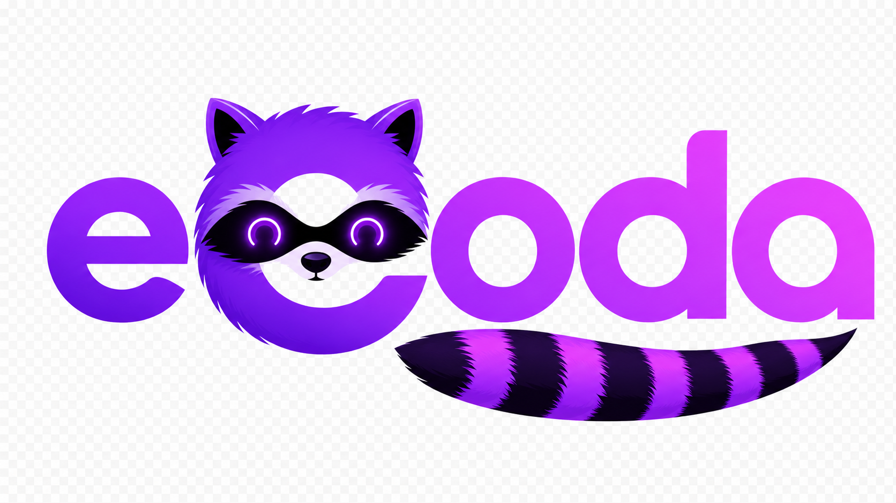
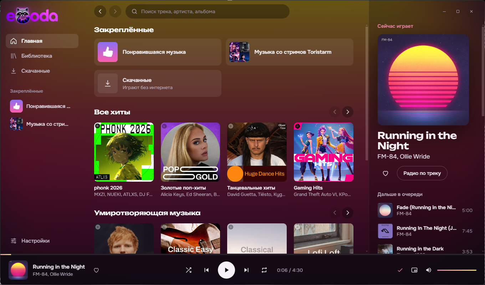

  

  ### Твой YouTube Music как обычное приложение для ПК

  
  

eCoda — десктоп-клиент для YouTube Music со своим окном и своим плеером. Музыка не живёт во вкладке, которая теряется среди тридцати других, и страница YT не держит в фоне гигабайт памяти.

Оформление подстраивается под то, что играет: фоном лежит размытая обложка трека, а кнопки и акценты берут её цвет.

  

## Что умеет

- Показывает твою настоящую библиотеку YT Music: плейлисты, «Понравившуюся музыку», подписки. Что есть у тебя в браузере, то есть и тут.
- Красится под обложку. Сменился трек — фон плавно перетекает в новый цвет. Если обложка чёрно-белая, остаётся фирменный фиолетовый.
- Держит очередь на виду. Справа колонка «Сейчас играет»: обложка, «Радио по треку» и то, что заиграет дальше. Любой трек из списка можно включить кликом.
- Правит твои плейлисты: добавляй и удаляй треки правым кликом, изменения уходят в YT.
- Делится треками: правый клик по песне → «Скопировать ссылку», и ссылка на YouTube уже в буфере.
- Качает музыку на диск: отдельный трек, плейлист целиком или всё, что лайкнул. Потом слушай без интернета, например в самолёте.
- Делает кросс-фейд между треками, от 0 до 12 секунд.
- Даёт 10-полосный эквалайзер с пресетами (Бас, Вокал, Рок и другие) и ручными ползунками ±12 дБ.
- Сворачивается в мини-плеер поверх всех окон, чтобы переключать треки и крутить громкость, не отрываясь от работы. Есть тонкая полоска и квадратик с обложкой.
- Слушается медиа-клавиш Play/Pause/Next/Prev, показывается в виджете на экране блокировки Windows и в Now Playing на macOS.
- Управляется с клавиатуры: пробел ставит на паузу, стрелки перематывают и переключают треки, Ctrl+F открывает поиск. Полный список в настройках.
- Уходит в трей по крестику, и музыка играет дальше. Если бесит, отключается в настройках.
- Говорит по-русски и по-английски.
- Помнит, где ты остановился: закрыл посреди трека, открыл назавтра и продолжил с той же секунды.
- Помогает стримерам: интро можно закрепить первым, остальное перетасовать в один клик, порядок треков меняется перетаскиванием.
- Играет в выбранное устройство (наушники, колонки, виртуальный кабель для стрима), независимо от системного звука по умолчанию.

И много мелочей, которые замечаешь уже в процессе.

## Скачать

### [⬇️ Последняя версия на GitHub Releases](https://github.com/erneywhite/eCoda/releases/latest)

| Платформа | Файл | Размер |
| --- | --- | --- |
| Windows 10/11 (x64) | `eCoda-Setup-<версия>.exe` | ~131 МБ |
| macOS (Apple Silicon — M1/M2/M3/M4) | `eCoda-<версия>-arm64.dmg` | ~160 МБ |

## Установка

### Windows

1. Скачай `.exe` по ссылке выше и запусти.
2. Защитник Windows может предупредить, что издатель неизвестен. Так бывает с приложениями без подписи Microsoft (а это $300 в год, я не платил, извините). Жми «Подробнее» → «Выполнить в любом случае».
3. Пройди установщик как обычно.
4. Запусти eCoda и выбери браузер, в котором ты уже залогинен на YouTube. eCoda возьмёт оттуда твою сессию, пароли вводить не нужно.

### macOS

1. Скачай `.dmg`, открой и перетащи eCoda в «Программы».
2. При первом запуске macOS заругается: приложение не подписано через Apple Developer Program ($99 в год, тоже не платил). Обходится так:
   - правый клик по eCoda в «Программах» → «Открыть»;
   - в появившемся окне ещё раз «Открыть».

   Это нужно один раз, дальше eCoda запускается обычным двойным кликом.
3. Выбери браузер, в котором залогинен на YouTube, eCoda прочитает оттуда cookies.

## Что нужно

- Браузер, в котором ты залогинен на YouTube. Подходят почти все: Firefox, Chrome, Edge, Brave, Opera, Vivaldi, Chromium, Whale, Safari (только на Mac) и форки Firefox (Waterfox, LibreWolf, Floorp, Zen).
  > Держать браузер открытым не нужно: eCoda читает cookies один раз при подключении.
- YouTube Premium желателен. С ним треки идут в 256 kbps Opus и без рекламных пауз. Без Premium тоже работает, но с рекламой и не выше 128 kbps.

Регистрации, аккаунтов и телеметрии нет, всё хранится у тебя на диске.

## Как пользоваться

После подключения браузера:

- Слева сайдбар: Главная (закреплённые плейлисты и рекомендации YT), Библиотека (твои плейлисты), Скачанные (то, что лежит на диске).
- Поиск — строка сверху, или Ctrl+F.
- «Понравившаяся музыка» сама появится в сайдбаре как закреплённый плейлист. Любой другой плейлист закрепляется кнопкой 📌 в его шапке.
- Правый клик по треку открывает меню: «Играть следующим», «Добавить в очередь», «Радио по треку», «Добавить в плейлист», «Удалить из плейлиста», «Закрепить позицию».
- Сердечко рядом с треком лайкает и снимает лайк, лайки синхронизируются с YT.
- Справа колонка «Сейчас играет» с обложкой, «Радио по треку» и очередью. В узком окне колонка прячется, а очередь открывается кнопкой в плеере.
- Мини-плеер включается кнопкой в нижнем плеере, справа рядом с громкостью.
- Настройки внизу сайдбара: язык, качество скачивания, кросс-фейд, эквалайзер, устройство вывода, поведение крестика, медиа-клавиши, горячие клавиши.

## Частые вопросы

<b>Это легально?</b>

eCoda — клиент к YouTube. Он ходит в тот же API, что и официальный YT Music, и играет только то, что доступно в твоём аккаунте.

При этом клиент неофициальный и с YouTube и Google никак не связан. Используй на свой страх и риск и уважай правила YouTube.

<b>Будет ли мобильная версия?</b>

Нет, проект только для десктопа. На телефонах есть официальное приложение YT Music, и оно отлично работает.

<b>Где хранятся скачанные треки?</b>

- Windows: `%APPDATA%\ecoda\offline\`
- macOS: `~/Library/Application Support/ecoda/offline/`

Папку можно открыть прямо из приложения: Настройки → Диагностика → «Открыть» рядом с «Папка кеша».

<b>Обновления приходят автоматически?</b>

Да. При запуске eCoda тихо проверяет GitHub Releases, и если вышла новая версия, она появится в Настройках → Обновления. Скачиваешь одним кликом и жмёшь «Перезапустить и установить». Если апдейтер молчит, там же есть кнопка «Проверить обновления».

Отдельно обновляется yt-dlp, через который eCoda достаёт музыку с YouTube. Когда YouTube что-то у себя меняет, треки перестают включаться до свежего yt-dlp. eCoda сама проверяет его раз в сутки и сразу после неудачной попытки включить трек, качает новую версию и переключается на неё без обновления всего приложения. Текущая версия видна в Настройках → Обновления, там же её можно проверить вручную.

<b>На macOS Safari не работает или просит доступ</b>

Safari хранит cookies в защищённой папке, и чтобы их прочитать, eCoda нужен полный доступ к диску:

Системные настройки → Конфиденциальность и безопасность → Полный доступ к диску → включить eCoda

После этого перезапусти приложение, и Safari появится в списке браузеров.

<b>Можно сменить аккаунт?</b>

Да: Настройки → Аккаунт → «Отключить», потом снова выбери браузер. Чтобы сменить аккаунт YouTube, перелогинься в браузере и подключи его в eCoda заново.

<b>А что насчёт Linux?</b>

Сборки под Linux пока нет. Код кросс-платформенный (Electron, youtubei.js и yt-dlp работают везде), просто руки не дошли собрать `.deb`/`.AppImage` и проверить. Если нужно — открой Issue или пришли PR.

## Благодарности

- Енота-маскота и логотип нарисовал [╻٭𝕊˙𖣐˙ℝ˙𝔸˙𝕊٭╹](https://t.me/S_O_R_A_S).
- Без [yt-dlp](https://github.com/yt-dlp/yt-dlp) и [youtubei.js](https://github.com/LuanRT/YouTube.js) этого приложения бы не было.
- Всё работает на [Electron](https://www.electronjs.org/), [Svelte](https://svelte.dev/) и [Deno](https://deno.com/). Шрифты — [Onest](https://fonts.google.com/specimen/Onest) и [Unbounded](https://fonts.google.com/specimen/Unbounded) (OFL).

## Лицензия

[MIT](LICENSE): делай с кодом что хочешь, только не вини меня, если что-то сломается.

eCoda — неофициальный клиент, не связанный с YouTube или Google, и сделан для личного использования. Уважай правила YouTube и местные законы.

Багрепорты и идеи пиши в [Issues](https://github.com/erneywhite/eCoda/issues).

Made with 🦝 by Erney White, 2026

---

<h3>🇬🇧 English version</h3>

### Your YouTube Music as a real desktop app

eCoda is a desktop client for YouTube Music with its own window and its own player. Your music doesn't live in a tab lost among thirty others, and no background YT page holds a gigabyte of memory.

The look follows whatever is playing: the track's cover, blurred, is the background, and buttons and accents take its colour.

  

## What it does

- Shows your real YT Music library: playlists, Liked Music, subscriptions. What you have in the browser, you have here.
- Takes its colour from the cover. When the track changes, the background flows into the new colour. A black-and-white cover falls back to the eCoda violet.
- Keeps the queue in view. On the right, a "Now playing" column: cover, track radio and what plays next. Click any track in the list to play it.
- Edits your playlists: add and remove tracks with a right-click, changes sync to YT.
- Shares tracks: right-click a song → "Copy link", and the YouTube link is on your clipboard.
- Downloads music to disk: a single track, a whole playlist or everything you've liked. Listen offline later, on a plane for example.
- Crossfades between tracks, 0 to 12 seconds.
- Has a 10-band equalizer with presets (Bass, Vocal, Rock and more) and manual sliders, ±12 dB per band.
- Shrinks into an always-on-top mini-player for skipping tracks and adjusting volume without leaving what you're doing. Two layouts: a thin strip or a square with the cover.
- Answers to the Play/Pause/Next/Prev media keys and shows up in the Windows lock-screen widget and macOS Now Playing.
- Works from the keyboard: Space pauses, arrows seek and switch tracks, Ctrl+F opens search. The full list is in Settings.
- Closes to the tray, and the music keeps playing. If that annoys you, turn it off in Settings.
- Speaks Russian and English.
- Remembers where you left off: close mid-track, reopen tomorrow, carry on from the same second.
- Helps streamers: pin an intro track first, reshuffle the rest in one click, reorder tracks by dragging.
- Plays to the device you choose (headphones, speakers, a virtual cable for streaming), independent of the system default.

Plus lots of small touches you notice along the way.

## Download

### [⬇️ Latest release on GitHub](https://github.com/erneywhite/eCoda/releases/latest)

| Platform | File | Size |
| --- | --- | --- |
| Windows 10/11 (x64) | `eCoda-Setup-<version>.exe` | ~131 MB |
| macOS (Apple Silicon — M1/M2/M3/M4) | `eCoda-<version>-arm64.dmg` | ~160 MB |

## Install

### Windows

1. Download the `.exe` from the link above and run it.
2. Windows Defender may warn about an unknown publisher. That happens with apps not signed by Microsoft (that's $300 a year, hard pass). Click "More info" → "Run anyway".
3. Step through the installer as usual.
4. Launch eCoda and pick the browser where you're already signed into YouTube. eCoda takes your session from there, no passwords needed.

### macOS

1. Download the `.dmg`, open it and drag eCoda into Applications.
2. On first launch macOS will complain: the app isn't signed through the Apple Developer Program ($99 a year, also a pass). The way around it:
   - right-click eCoda in Applications → "Open";
   - click "Open" again in the dialog.

   You only do this once; after that eCoda opens with a normal double-click.
3. Pick a browser signed into YouTube, and eCoda reads the cookies from it.

## What you need

- A browser signed into YouTube. Almost all work: Firefox, Chrome, Edge, Brave, Opera, Vivaldi, Chromium, Whale, Safari (macOS only) and Firefox forks (Waterfox, LibreWolf, Floorp, Zen).
  > The browser doesn't need to stay open: eCoda reads the cookies once when you connect.
- YouTube Premium is recommended. With it, tracks come as 256 kbps Opus with no ad breaks. Without it eCoda still works, but with ads and at most 128 kbps.

No signup, no accounts, no telemetry; everything stays on your disk.

## How to use it

After connecting a browser:

- Sidebar on the left: Home (your pinned playlists and YT recommendations), Library (your playlists), Downloaded (what's saved to disk).
- Search is the field at the top, or Ctrl+F.
- Liked Music shows up in the sidebar as a pinned playlist on its own. Pin any other playlist with the 📌 button in its header.
- Right-click a track for the menu: "Play next", "Add to queue", "Start radio", "Add to playlist", "Remove from playlist", "Pin position".
- The heart next to a track likes and unlikes it; likes sync to YT.
- On the right, the "Now playing" column with the cover, track radio and the queue. In a narrow window the column hides and the queue opens from a button in the player.
- The mini-player button is in the bottom player, right next to the volume.
- Settings at the bottom of the sidebar: language, download quality, crossfade, equalizer, output device, close-button behaviour, media keys, keyboard shortcuts.

## FAQ

<b>Is this legal?</b>

eCoda is a client for YouTube. It talks to the same API as the official YT Music app and only plays what's available in your account.

It is, however, an unofficial client with no connection to YouTube or Google. Use it at your own risk and respect YouTube's terms.

<b>Will there be a mobile version?</b>

No, the project is desktop-only. Phones already have the official YT Music app, and it works fine.

<b>Where are downloaded tracks stored?</b>

- Windows: `%APPDATA%\ecoda\offline\`
- macOS: `~/Library/Application Support/ecoda/offline/`

You can open the folder from the app: Settings → Diagnostics → "Open" next to "Cache folder".

<b>Are updates automatic?</b>

Yes. On launch eCoda quietly checks GitHub Releases, and a new version shows up in Settings → Updates. Download it in one click, then "Restart and install". If the updater is quiet, the same page has a "Check for updates" button.

yt-dlp, which eCoda uses to get music from YouTube, updates on its own. When YouTube changes something on its side, tracks stop playing until yt-dlp catches up. eCoda checks for a new yt-dlp once a day and right after a track fails to load, downloads it and switches over without updating the whole app. The current version is shown in Settings → Updates, where you can also check manually.

<b>After updating, my desktop shortcut shows the old icon</b>

Windows caches shortcut icons and refreshes them lazily. Any of these helps:
- reboot;
- run `ie4uinit.exe -show` in cmd;
- delete the shortcut and recreate it from the Start menu.

The icon inside the `.exe` is already the new one.

<b>On macOS, Safari doesn't work or asks for permission</b>

Safari keeps its cookies in a protected folder, and eCoda needs Full Disk Access to read them:

System Settings → Privacy & Security → Full Disk Access → enable eCoda

Then restart the app, and Safari appears in the browser list.

<b>Can I switch accounts?</b>

Yes: Settings → Account → "Disconnect", then pick a browser again. To switch YouTube accounts, sign into the other one in the browser and reconnect it in eCoda.

<b>What about Linux?</b>

No Linux build yet. The code is cross-platform (Electron, youtubei.js and yt-dlp run everywhere); I just haven't packaged a `.deb`/`.AppImage` and tested it. If you need it, open an Issue or send a PR.

## Credits

- The raccoon mascot and the logo were drawn by [╻٭𝕊˙𖣐˙ℝ˙𝔸˙𝕊٭╹](https://t.me/S_O_R_A_S).
- Without [yt-dlp](https://github.com/yt-dlp/yt-dlp) and [youtubei.js](https://github.com/LuanRT/YouTube.js) this app wouldn't exist.
- Everything runs on [Electron](https://www.electronjs.org/), [Svelte](https://svelte.dev/) and [Deno](https://deno.com/). Fonts: [Onest](https://fonts.google.com/specimen/Onest) and [Unbounded](https://fonts.google.com/specimen/Unbounded) (OFL).

## License

[MIT](LICENSE): do whatever you want with the code, just don't blame me if something breaks.

eCoda is an unofficial client, not affiliated with YouTube or Google, built for personal use. Respect YouTube's terms and your local laws.

Bug reports and ideas go to [Issues](https://github.com/erneywhite/eCoda/issues).

Made with 🦝 by Erney White, 2026

